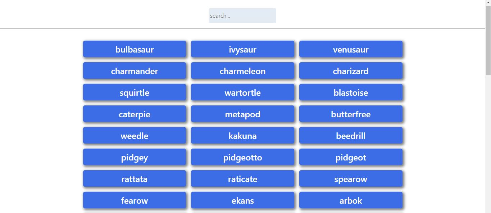

# Pokemon-app

## About

Pokemon-app loads and displays pokemons fetched from the [pokeApi](https://pokeapi.co/). Each pokemon element displays futher details about the particular pokemon by use of a modal on user click.

## Built With

- HTML,CSS & Javascript
- Bootstrap

## Live Demo

[Live Demo Link](https://tabetommy.github.io/pokemon-app/)

## Lessons learned

- During this project i learnt how to use the fetch API to load data from eternal APIs
- I also learnt how to use IIFEs(immediately invoked function expressions) to isolate variable declarations

👤 **Author1**

- Github: [@githubhandle](https://github.com/tabetommy)
- Linkedin: [linkedin](https://www.linkedin.com/in/tommy-egbe-304464116/)

## 🤝 Contributing

Contributions, issues and feature requests are welcome!

Feel free to check the [issues page](issues/).

## Show your support

Give a ⭐️ if you like this project!

