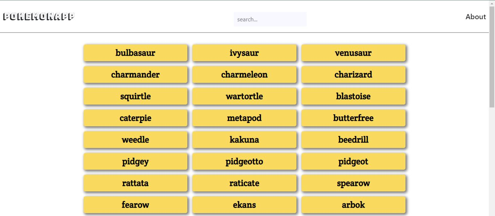

# Pokemon-app

## About

Pokemon-app displays pokemons fetched from the [pokeApi](https://pokeapi.co/). When clicked, each pokemon element displays futher details about the particular pokemon by use of a modal.

## Built With

- HTML,CSS & Javascript
- Bootstrap
- technologies used

## Live Demo

[Live Demo Link](https://tabetommy.github.io/pokemon-app/)

## Getting Started

**This is an example of how you may give instructions on setting up your project locally.**
**Modify this file to match your project, remove sections that don't apply. For example: delete the testing section if the currect project doesn't require testing.**

To get a local copy up and running follow these simple example steps.

### Prerequisites

### Setup

### Install

### Usage

### Run tests

### Deployment

## Authors

👤 **Author1**

- Github: [@githubhandle](https://github.com/tabetommy)
- Linkedin: [linkedin](https://www.linkedin.com/in/tommy-egbe-304464116/)

## 🤝 Contributing

Contributions, issues and feature requests are welcome!

Feel free to check the [issues page](issues/).

## Show your support

Give a ⭐️ if you like this project!

## Acknowledgments

- Hat tip to anyone whose code was used
- Inspiration
- etc

## 📝 License

This project is [MIT](lic.url) licensed.
